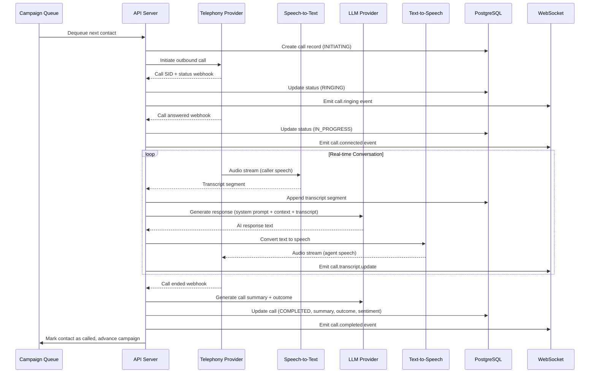
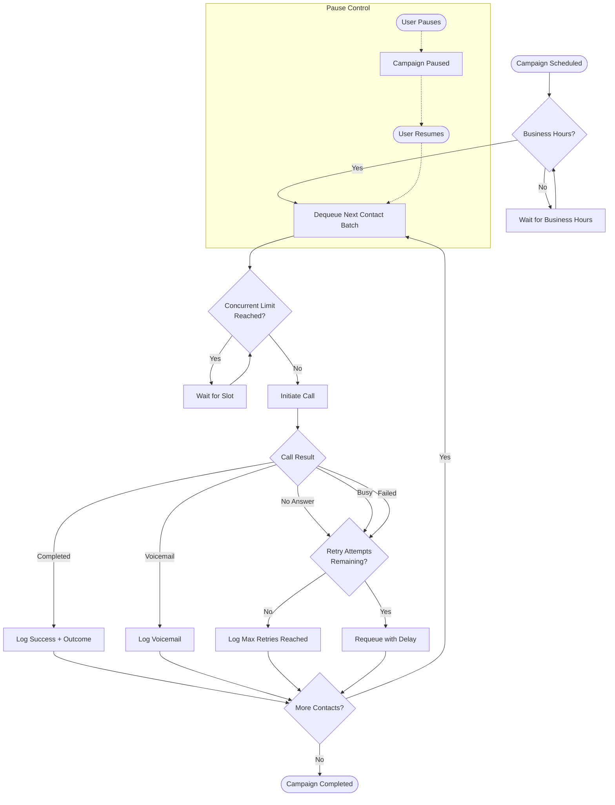
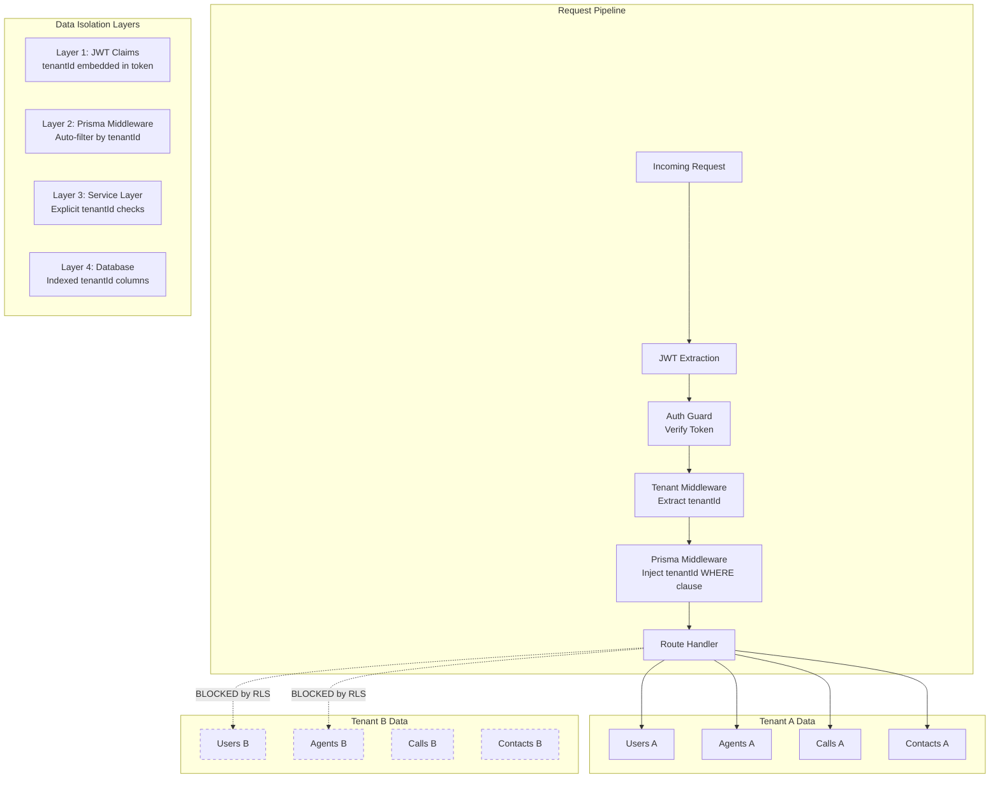

# Voice AI Agent Platform - Architecture

## System Overview

The Voice AI Agent Platform is a multi-tenant SaaS application that enables businesses to deploy AI-powered voice agents for automated phone calls. It supports healthcare, collections, legal, and sales use cases with real-time call orchestration, campaign management, and analytics.

```mermaid
graph TB
    subgraph "Client Layer"
        WEB[Next.js Web Dashboard]
        SDK[Client SDK / API Consumers]
    end

    subgraph "API Gateway"
        API[NestJS REST API<br/>v1 URI Versioning]
        WS[WebSocket Gateway<br/>Real-time Events]
        SWAGGER[Swagger/OpenAPI Docs]
    end

    subgraph "Core Services"
        AUTH[Auth Module<br/>JWT + RBAC]
        AGENTS[Agents Module]
        CAMPAIGNS[Campaigns Module]
        CALLS[Calls Module]
        CONTACTS[Contacts Module]
        WORKFLOWS[Workflows Module]
        KB[Knowledge Base Module]
        ANALYTICS[Analytics Module]
        BILLING[Billing Module]
        AUDIT[Audit Module]
    end

    subgraph "Background Processing"
        BULL[Bull Queue<br/>Campaign Execution]
        CRON[Scheduler<br/>@nestjs/schedule]
    end

    subgraph "External Services"
        LLM[LLM Orchestrator<br/>OpenAI / Anthropic / Groq]
        STT[Speech-to-Text<br/>Deepgram / Whisper]
        TTS[Text-to-Speech<br/>ElevenLabs / OpenAI TTS]
        TEL[Telephony<br/>Twilio / Vonage / Telnyx]
    end

    subgraph "Data Layer"
        PG[(PostgreSQL<br/>Primary Database)]
        REDIS[(Redis<br/>Cache + Queues)]
        S3[(S3/MinIO<br/>Recordings + Docs)]
    end

    WEB --> API
    SDK --> API
    WEB --> WS
    API --> AUTH
    API --> AGENTS
    API --> CAMPAIGNS
    API --> CALLS
    API --> CONTACTS
    API --> WORKFLOWS
    API --> KB
    API --> ANALYTICS
    API --> BILLING
    API --> AUDIT
    AUTH --> PG
    AGENTS --> PG
    CAMPAIGNS --> BULL
    CALLS --> TEL
    CALLS --> LLM
    CALLS --> STT
    CALLS --> TTS
    KB --> S3
    BULL --> REDIS
    BULL --> CALLS
    CRON --> CAMPAIGNS
    CALLS --> PG
    ANALYTICS --> PG
    ANALYTICS --> REDIS
```

## Tech Stack Rationale

| Layer | Technology | Rationale |
|-------|-----------|-----------|
| **Frontend** | Next.js 14 (App Router) | Server components for fast initial loads, built-in API routes for BFF pattern, excellent DX with TypeScript |
| **API** | NestJS | Enterprise-grade Node.js framework with dependency injection, modular architecture, built-in support for WebSockets, queues, and scheduling |
| **Database** | PostgreSQL + Prisma | Robust relational DB for multi-tenant data with strong consistency. Prisma provides type-safe queries and migrations |
| **Cache/Queue** | Redis + Bull | In-memory caching for real-time analytics, Bull queues for reliable campaign job processing |
| **Telephony** | Twilio / Vonage / Telnyx | Multi-provider abstraction for carrier redundancy and cost optimization |
| **LLM** | OpenAI / Anthropic / Groq | Multi-provider LLM orchestration for conversation intelligence, with Groq for low-latency inference |
| **Speech** | Deepgram (STT) + ElevenLabs (TTS) | Best-in-class accuracy for real-time transcription and natural-sounding voice synthesis |
| **Storage** | S3 / MinIO | Scalable object storage for call recordings and knowledge base documents |
| **Monorepo** | Turborepo + pnpm | Fast incremental builds, shared configs and packages, efficient dependency management |

## Module Breakdown

### Core Modules

- **AuthModule** - JWT authentication, bcrypt password hashing, RBAC with role hierarchy (SUPER_ADMIN > TENANT_OWNER > MANAGER > AGENT_OPERATOR > VIEWER), refresh token rotation
- **TenantsModule** - Tenant CRUD, settings management, tenant-scoped data isolation via Prisma middleware
- **UsersModule** - User management scoped to tenant, role assignment, profile management
- **AgentsModule** - AI agent configuration (voice, LLM model, system prompt, temperature, interruption sensitivity), per-tenant isolation
- **WorkflowsModule** - Visual workflow builder with step types: SPEAK, COLLECT, CONDITION, API_CALL, AI_CLASSIFY, TRANSFER, END_CALL
- **ContactsModule** - Contact management with tags, custom fields, import/export, source tracking
- **CallsModule** - Call lifecycle management, transcript storage, sentiment analysis, outcome tracking
- **CampaignsModule** - Campaign creation, scheduling, execution via Bull queues, progress tracking, pause/resume
- **AnalyticsModule** - Real-time and historical metrics, call volume, sentiment trends, agent performance
- **KnowledgeBaseModule** - Document upload, chunking, embedding storage for RAG during live calls
- **BillingModule** - Subscription management (starter/professional/enterprise), usage metering, Stripe integration
- **NotificationsModule** - In-app notifications, email alerts, WebSocket push for real-time events
- **AdminModule** - Super admin operations, tenant management, feature flags, platform health
- **AuditModule** - Comprehensive audit logging for compliance (HIPAA, FDCPA, SOC2)

### Service Layer

- **TelephonyService** - Provider-agnostic telephony abstraction (Twilio, Vonage, Telnyx) with failover
- **LlmService** - Multi-provider LLM orchestration with fallback, token counting, streaming support
- **VoiceService** - STT/TTS pipeline management, real-time audio streaming, voice activity detection

## Data Flow: Call Lifecycle



## Data Flow: Campaign Execution



## Multi-Tenant Data Isolation



### Isolation Strategy

1. **Token-level**: Every JWT contains `tenantId`. Requests without a valid tenant context are rejected.
2. **Middleware-level**: Prisma middleware automatically appends `WHERE tenantId = ?` to all queries on tenant-scoped models.
3. **Service-level**: All service methods accept `tenantId` as a parameter and validate ownership before mutations.
4. **Database-level**: Composite indexes on `(tenantId, id)` for all tenant-scoped tables ensure efficient filtered queries.

## Real-Time Event Pipeline

```mermaid
graph LR
    subgraph "Event Sources"
        CALL_EVT[Call Status Changes]
        CAMP_EVT[Campaign Progress]
        TRANS_EVT[Transcript Updates]
        NOTIF_EVT[Notifications]
    end

    subgraph "Event Bus"
        EMITTER[NestJS EventEmitter]
        REDIS_PUB[Redis Pub/Sub<br/>Cross-instance sync]
    end

    subgraph "Delivery"
        WS_GW[WebSocket Gateway]
        ROOMS[Tenant Rooms<br/>tenant:{id}]
    end

    subgraph "Clients"
        DASH[Dashboard]
        LIVE[Live Call Monitor]
        CAMP_UI[Campaign Tracker]
    end

    CALL_EVT --> EMITTER
    CAMP_EVT --> EMITTER
    TRANS_EVT --> EMITTER
    NOTIF_EVT --> EMITTER

    EMITTER --> REDIS_PUB
    REDIS_PUB --> WS_GW
    WS_GW --> ROOMS
    ROOMS --> DASH
    ROOMS --> LIVE
    ROOMS --> CAMP_UI
```

### Event Types

| Event | Payload | Consumers |
|-------|---------|-----------|
| `call.initiating` | callId, contactId, agentId | Live monitor, Campaign tracker |
| `call.ringing` | callId, phoneNumber | Live monitor |
| `call.connected` | callId, startedAt | Live monitor, Dashboard |
| `call.transcript.update` | callId, segment | Live monitor |
| `call.completed` | callId, duration, outcome, sentiment | Dashboard, Analytics, Campaign tracker |
| `campaign.progress` | campaignId, completed, remaining, successRate | Campaign tracker |
| `campaign.completed` | campaignId, stats | Dashboard, Notifications |
| `notification.new` | userId, type, title, body | Dashboard header |

## Security Architecture

### Authentication & Authorization
- **JWT-based auth** with short-lived access tokens (1h) and longer refresh tokens (7d) with rotation
- **bcrypt** password hashing with 10 salt rounds
- **Role-Based Access Control (RBAC)** with hierarchical roles: SUPER_ADMIN > TENANT_OWNER > TENANT_ADMIN > MANAGER > AGENT_OPERATOR > QA_AUDITOR > VIEWER
- **Route-level guards** via `@Roles()` decorator and `JwtAuthGuard`

### API Security
- **Helmet** for HTTP security headers
- **Rate limiting** via `@nestjs/throttler` (100 requests/minute default)
- **CORS** with configurable allowed origins
- **Input validation** with `class-validator` (whitelist mode, no unknown properties)
- **API versioning** (URI-based, `/v1/`)

### Data Security
- **Tenant isolation** at 4 layers (JWT, middleware, service, database)
- **Audit logging** for all sensitive operations (login, data mutations, role changes)
- **Encryption at rest** for call recordings and sensitive customer data
- **PII handling** compliant with HIPAA (healthcare), FDCPA (collections), and SOC2

### Infrastructure Security
- **Secrets management** via environment variables (`.env.local` excluded from VCS)
- **Database connection** via SSL in production
- **Redis AUTH** enabled in production
- **S3 bucket policies** scoped per tenant prefix

## Deployment Architecture

### Development
```
pnpm dev          # Starts all apps via Turborepo
docker compose up  # PostgreSQL + Redis + MinIO
```

### Production
- **API**: Containerized NestJS deployed on AWS ECS / GCP Cloud Run
- **Web**: Next.js on Vercel or self-hosted with Node.js
- **Database**: AWS RDS PostgreSQL (Multi-AZ) or GCP Cloud SQL
- **Cache**: AWS ElastiCache Redis or GCP Memorystore
- **Storage**: AWS S3 with lifecycle policies for recording retention
- **CDN**: CloudFront / Vercel Edge for static assets
- **Monitoring**: Datadog / Grafana for metrics, Sentry for error tracking
- **CI/CD**: GitHub Actions with Turborepo remote caching

### Scaling Considerations
- **Horizontal API scaling**: Stateless NestJS instances behind a load balancer; Redis Pub/Sub for WebSocket cross-instance sync
- **Campaign throughput**: Bull queue with configurable concurrency per campaign and global limits
- **Database**: Read replicas for analytics queries; connection pooling via PgBouncer
- **Telephony**: Multi-provider failover for carrier-level redundancy
- **LLM**: Multi-provider routing with Groq for latency-sensitive real-time calls, OpenAI/Anthropic for quality-critical tasks
