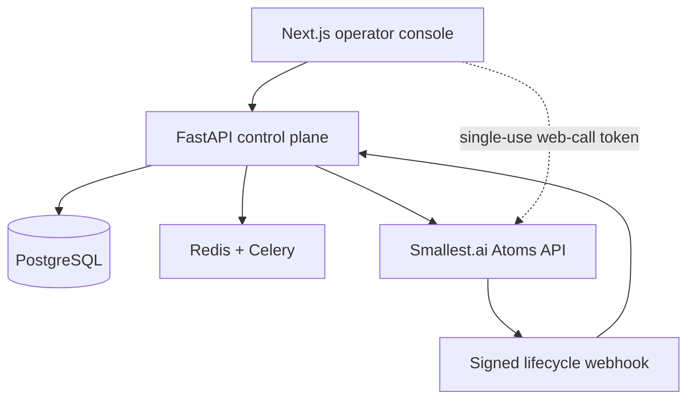

# VAV Voice AI

An enterprise voice-agent workspace for building, governing, testing, and operating multilingual [Smallest.ai Atoms](https://docs.smallest.ai/voice-agents/developer-guide/get-started/build-with-a-coding-agent) agents.

This repository combines a multi-tenant FastAPI control plane with a polished Next.js operator console. The Smallest.ai API key stays on the server; browsers receive only short-lived, single-use web-call tokens.

## What is included

- Local-first agent authoring with explicit Smallest.ai provisioning and versioned publishing
- Secure browser voice playground using `@smallest-ai/agent-sdk`
- Controlled outbound calls with E.164 validation and per-call variables
- Signed Smallest.ai lifecycle webhooks for pre-call, post-call, transcript, recording, and analytics ingestion
- Conversation reporting, transcripts, outcomes, campaigns, DNC/consent, workflows, billing, and tenant isolation
- Owner/admin controls for provider mutations, reproducible PostgreSQL migrations, Docker builds, and CI

## Architecture



Provider operations are deliberate: creating a local draft does not make an external API call. An owner or admin must provision the agent, then publish later edits through the provider branch workflow.

## Quick start

Requirements: Docker, Docker Compose, and a Smallest.ai API key.

```bash
cp .env.example .env
# Set SECRET_KEY, SMALLEST_API_KEY, and SMALLEST_WEBHOOK_SECRET in .env

docker compose up -d db redis
docker compose build api frontend worker
docker compose run --rm api alembic upgrade head
docker compose up api worker frontend
```

Open [http://localhost:3000](http://localhost:3000). Register the first workspace owner, create a local agent draft, provision it, and open the playground.

For local development without Docker:

```bash
cd backend
python -m venv .venv
source .venv/bin/activate
pip install -e '.[dev]'
alembic upgrade head
uvicorn app.main:app --reload
```

```bash
cd frontend
npm ci
npm run dev
```

## Railway deployment

Deploy this isolated monorepo as five Railway services. For each GitHub service, select the production branch and set the root directory shown below in Railway's service settings:

| Service | Source/root | Deployment settings | Public domain |
| --- | --- | --- | --- |
| `api` | GitHub, `/backend` | Dockerfile; pre-deploy `alembic upgrade head`; health check `/health` | Yes |
| `worker` | GitHub, `/backend` | Dockerfile; start `sh -c 'celery -A app.tasks.worker worker --loglevel=info --concurrency=${WORKER_CONCURRENCY:-2}'` | No |
| `frontend` | GitHub, `/frontend` | Dockerfile; health check `/` | Yes |
| `Postgres` | Railway database | Managed | No |
| `Redis` | Railway database | Managed | No |

Set these service variables with Railway references where shown:

| Service | Variable | Value |
| --- | --- | --- |
| API + worker | `DATABASE_URL` | `${{Postgres.DATABASE_URL}}` |
| API + worker | `REDIS_URL` | `${{Redis.REDIS_URL}}` |
| API | `CORS_ORIGINS` | `https://${{frontend.RAILWAY_PUBLIC_DOMAIN}}` |
| API | `BASE_URL` | `https://${{api.RAILWAY_PUBLIC_DOMAIN}}` |
| Frontend | `NEXT_PUBLIC_API_URL` | `https://${{api.RAILWAY_PUBLIC_DOMAIN}}` |
| API | `SECRET_KEY` | A generated, sealed production secret |
| API + worker | `SMALLEST_API_KEY` | A sealed Smallest.ai API key |
| API | `SMALLEST_WEBHOOK_SECRET` | A generated, sealed webhook signing secret |

Railway deprecated Config as Code for new services, so configure these settings in the dashboard instead of relying on `railway.toml`. The API migration must run before traffic switches, both web services use Railway's dynamic `PORT`, and the frontend build embeds the API's public HTTPS URL. Generate public Railway domains for `api` and `frontend`, then configure the Smallest.ai webhook as `https://YOUR_API_DOMAIN/api/v1/webhooks/smallest`.

## Smallest.ai configuration

All provider credentials belong in the backend environment only:

| Variable | Purpose |
| --- | --- |
| `SMALLEST_API_KEY` | Server-to-server Atoms API authentication |
| `SMALLEST_BASE_URL` | Atoms API base URL; defaults to the production v1 endpoint |
| `SMALLEST_WEBHOOK_SECRET` | HMAC-SHA256 verification secret for lifecycle events |
| `SMALLEST_DEFAULT_FROM_NUMBER` | Optional display/audit number for provider-managed outbound calls |
| `SMALLEST_REQUEST_TIMEOUT_SECONDS` | Provider request timeout |

Configure the Smallest.ai agent webhook as:

```text
https://YOUR_API_DOMAIN/api/v1/webhooks/smallest
```

Use the same signing secret in Smallest.ai and `SMALLEST_WEBHOOK_SECRET`. Never place the raw API key in a `NEXT_PUBLIC_*` variable.

## Core provider flow

| Action | Endpoint | External effect |
| --- | --- | --- |
| Create local draft | `POST /api/v1/agents` | None |
| Provision Atoms agent | `POST /api/v1/agents/{id}/smallest/provision` | Creates, configures, and publishes the remote agent |
| Publish changes | `POST /api/v1/agents/{id}/smallest/sync` | Updates and publishes the default branch draft |
| Mint browser session | `POST /api/v1/agents/{id}/smallest/session` | Returns a short-lived web-call token |
| Start outbound call | `POST /api/v1/calls` | Starts a provider conversation |

## Verification

```bash
cd backend && python -m ruff check app tests migrations && python -m ruff format --check app tests migrations && python -m pytest -q
cd frontend && npm ci && npm run lint && npm run build && npm audit --omit=dev
```

Provider contract tests use mocked HTTP transports and never spend credits or place calls.

## Production launch checklist

- Use managed PostgreSQL and Redis with backups, encryption, and private networking.
- Generate a strong `SECRET_KEY`; restrict `CORS_ORIGINS` to the console domains.
- Terminate TLS at the edge and expose only the API routes required by the console and webhooks.
- Configure and verify the Smallest.ai webhook before enabling live traffic.
- Confirm regional recording consent, DNC, retention, and data-residency requirements.
- Run browser, inbound, outbound, interruption, transfer, voicemail, and failure-path tests with approved numbers.
- Add observability, alerting, rate limits, and a secret manager before production traffic.

The current branch establishes the Smallest.ai-native platform foundation. Live telephony activation, provider-side phone-number assignment, domain-specific tools/knowledge, and production deployment remain environment-specific launch work.
