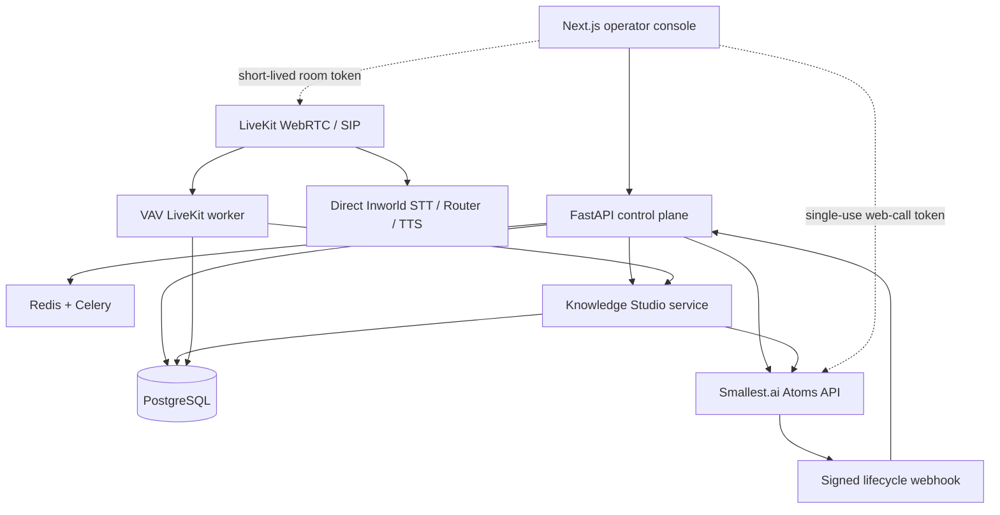

# VAV Voice AI

An enterprise voice-agent workspace for building, governing, testing, and operating multilingual [Smallest.ai Atoms](https://docs.smallest.ai/voice-agents/developer-guide/get-started/build-with-a-coding-agent) agents.

This repository combines a multi-tenant FastAPI control plane with a polished Next.js operator console. Its preferred production phone lane is customer-owned e& SIP through LiveKit with direct Inworld STT, Router LLM, and TTS; the existing Sarvam/Twilio path remains available for controlled rollback.

## What is included

- Local-first, editable agent authoring with Smallest.ai's public voice/language catalog, five governed templates, explicit provisioning, and versioned publishing. Private voice clones stay unavailable until tenant-owned provider entitlements are implemented.
- Provider-neutral Knowledge Studio with reusable group/division/branch/department scopes, automatic robots-aware whole-site crawling, curated URL and sitemap ingestion, JavaScript recovery, bounded PDF uploads, page-level repair ledgers, provider-verified indexing, approval gates, agent bindings, and tenant-scoped audit history.
- Secure browser voice playground using `@smallest-ai/agent-sdk` for Smallest
  agents and short-lived LiveKit WebRTC sessions for direct Inworld agents
- Controlled outbound calls and bounded campaigns with tenant-scoped E.164 DNC enforcement, calling windows, pause checks, and Smallest/Twilio provider routing
- Signed Smallest.ai and Twilio lifecycle ingestion plus signed, idempotent outbound integration webhooks with retry and destination safety checks
- Conversation reporting with accessible transcript and AI-summary review
- Expiring single-use workspace invitations, team roles/access, one-time API-key reveal, revocation, and tenant-scoped audit history
- Authenticated encryption at rest for write-only integration credentials, safe secret replacement, HTTPS/SSRF validation, and tenant-isolated CRUD
- A separately deployable LiveKit worker that keeps VAV knowledge, actions, transcripts, usage, and cost attribution in the VAV control plane while using direct Inworld APIs (not LiveKit Inference)
- Reproducible PostgreSQL migrations, worker queue registration tests, hardened browser/API headers, Docker builds, and PostgreSQL-backed CI migration checks

The complete target product is defined in [the world-class platform blueprint](docs/WORLD_CLASS_VOICE_AI_PLATFORM.md). It specifies the 14-module information architecture, provider-neutral data and service contracts, security and compliance gates, SLOs, UAE/India/WhatsApp differentiation, and the staged R0-R5 implementation plan.

## Architecture



Provider operations are deliberate: creating a local draft does not make an external API call. An owner or admin must provision the agent, then publish later edits through the provider branch workflow.

## Quick start

Requirements: Docker, Docker Compose, and a Smallest.ai API key.

```bash
cp .env.example .env
# Set SECRET_KEY, INTEGRATION_ENCRYPTION_KEY, SMALLEST_API_KEY, and SMALLEST_WEBHOOK_SECRET

docker compose up -d db redis
docker compose build api frontend worker
docker compose run --rm api alembic upgrade head
docker compose up api worker frontend
```

Open [http://localhost:3000](http://localhost:3000). Register the first workspace owner, create a local agent draft, provision it, and open the playground.

For local development without Docker:

```bash
cd backend
python -m venv .venv
source .venv/bin/activate
pip install -e '.[dev]'
alembic upgrade head
uvicorn app.main:app --reload
```

```bash
cd frontend
npm ci
npm run dev
```

## Railway deployment

Deploy this isolated monorepo as six Railway services. For each GitHub service, select the production branch and set the root directory shown below in Railway's service settings:

| Service | Source/root | Deployment settings | Public domain |
| --- | --- | --- | --- |
| `api` | GitHub, `/backend` | Dockerfile; pre-deploy `alembic upgrade head`; health check `/ready` | Yes |
| `worker` | GitHub, `/backend` | Dockerfile; start `sh -c 'celery -A app.tasks.worker worker -B --loglevel=info --concurrency=${WORKER_CONCURRENCY:-2}'` (exactly one replica runs Beat) | No |
| `livekit-agent` | GitHub, `/backend` | Dockerfile; start `python -m app.livekit_runtime.worker start`; health check `/`; at least one always-on replica | No |
| `frontend` | GitHub, `/frontend` | Dockerfile; health check `/` | Yes |
| `Postgres` | Railway database | Managed | No |
| `Redis` | Railway database | Managed | No |

Set these service variables with Railway references where shown:

| Service | Variable | Value |
| --- | --- | --- |
| API + worker + livekit-agent | `DATABASE_URL` | `${{Postgres.DATABASE_URL}}` |
| API + worker + livekit-agent | `REDIS_URL` | `${{Redis.REDIS_URL}}` |
| API + worker + livekit-agent | `APP_ENV` | `production` |
| API + worker + livekit-agent | `CORS_ORIGINS` | `https://${{frontend.RAILWAY_PUBLIC_DOMAIN}}` |
| API + worker + livekit-agent | `BASE_URL` | `https://${{api.RAILWAY_PUBLIC_DOMAIN}}` |
| API + worker + livekit-agent | `TRUST_RAILWAY_PROXY_HEADERS` | `true` (uses Railway's edge-injected `X-Real-IP` for auth limits) |
| Frontend | `NEXT_PUBLIC_API_URL` | `https://${{api.RAILWAY_PUBLIC_DOMAIN}}` (build-time destination for the same-origin `/api/v1/*` proxy; it is not exposed as the browser request origin) |
| API + worker + livekit-agent | `SECRET_KEY` | One identical generated, sealed production secret |
| API + worker + livekit-agent | `INTEGRATION_ENCRYPTION_KEY` | One identical generated, sealed value on all three services; the LiveKit worker needs it to decrypt workspace Inworld credentials |
| API + worker + livekit-agent | `REGISTRATION_MODE` | `bootstrap` for first launch or `invite_only`; production rejects `open` |
| API + worker + livekit-agent | `BOOTSTRAP_OWNER_EMAIL` | Valid designated owner email, required only for `bootstrap` and never returned publicly |
| API | `LEGACY_SESSION_MIGRATION_ENABLED` | `false` by default; temporarily `true` only for the planned pre-cookie session rollout window |
| API + worker + livekit-agent | `SMALLEST_API_KEY` | A sealed Smallest.ai API key; currently part of the shared production startup gate even though the LiveKit lane does not call Smallest |
| API + worker + livekit-agent | `SMALLEST_WEBHOOK_SECRET` | One identical generated, sealed webhook signing secret |
| API + worker + livekit-agent | `SMALLEST_WEBHOOK_ID` | The Smallest.ai webhook ID whose signing secret is configured above |
| API + worker | `SARVAM_API_KEY` | Optional platform fallback for VAV realtime transcription and Sarvam speech |
| API + worker | `ELEVENLABS_API_KEY` | Optional platform fallback for ElevenLabs speech output only |
| API + worker | `OPENAI_API_KEY` | Optional platform fallback for VAV conversation generation |
| API + livekit-agent | `INWORLD_API_KEY` | Optional platform fallback; prefer an encrypted workspace key in Settings |
| API + livekit-agent | `LIVEKIT_URL`, `LIVEKIT_API_KEY`, `LIVEKIT_API_SECRET` | One shared LiveKit project; must match the project recorded in Settings |
| API + livekit-agent | `LIVEKIT_AGENT_NAME` | `vav-inworld`; must match the SIP dispatch rule |
| frontend | `LIVEKIT_BROWSER_CONNECT_ORIGIN` | Optional exact `wss://` or `https://` origin for self-hosted LiveKit; LiveKit Cloud is allowed automatically and no secret belongs here |
| livekit-agent | `LIVEKIT_NUM_IDLE_PROCESSES` | `1` initially; raise only after memory/load testing (VAV validates 1-16) |
| API | `LIVEKIT_WORKER_HEALTH_URL` | `http://${{livekit-agent.RAILWAY_PRIVATE_DOMAIN}}:${{livekit-agent.PORT}}`; required for activation and never browser-exposed |
| livekit-agent | `LIVEKIT_LOG_LEVEL` | `info` for production registration and dispatch evidence |
| API | `MAX_REQUEST_BODY_BYTES` | `8388608` (8 MiB app-wide ceiling; provider webhooks retain their tighter 2 MiB limit) |

The LiveKit worker imports the same production settings object as the API and Celery worker. Its shared variables are therefore a startup contract, not optional duplication. Railway injects `PORT`; the worker binds LiveKit Agents' built-in health server to that port. Set its health path to `/`, do not create a public domain, and do not override `PORT`. Configure `LIVEKIT_WORKER_HEALTH_URL` on the API with the worker's Railway private origin and actual port, without a path. VAV checks both `/` (LiveKit connection health) and `/worker` (registered agent name/type) before activation. The URL must never use a public domain or a `NEXT_PUBLIC_*` variable.

Railway deprecated Config as Code for new services. A repository-level `railway.toml` would also be shared by the existing API, Celery, frontend and agent services and could overwrite their different start commands, so this repository intentionally does not include one. Configure `livekit-agent` explicitly in the Railway dashboard: GitHub source, the same production branch as API, root `/backend`, Dockerfile builder, start `python -m app.livekit_runtime.worker start`, health `/`, one always-on replica, and no public domain.

The API migration must run before traffic switches, both web services use Railway's dynamic `PORT`, and the frontend build embeds the API's public HTTPS URL only as its fixed server-side rewrite destination. Browser requests remain on the frontend origin at `/api/v1/*`, keeping the refresh cookie first-party even when privacy controls block third-party cookies. Generate public Railway domains for `api` and `frontend`, then configure the Smallest.ai webhook as `https://YOUR_API_DOMAIN/api/v1/webhooks/smallest`.

After deploying the agent service, require all three checks before enabling a LiveKit runtime: Railway reports the deployment `SUCCESS`; `railway logs -s livekit-agent -e production --lines 100 --filter "registered worker"` includes `agent_name=vav-inworld`; and VAV **Test readiness** verifies the exact LiveKit project, trunk, dispatch rule, assigned DIDs, and live private worker registration. A running container or a saved agent name without a successful live probe is not ready for calls.

Use `/health` only as the inexpensive process-liveness probe. Railway must use
`/ready`: it returns `200` only when PostgreSQL is reachable and its
`alembic_version` exactly matches the schema expected by this API release;
otherwise it returns a detail-free `503`. Redis is intentionally not part of
whole-API readiness: an outage fails authentication abuse controls and queueing
operations closed while database-backed reads and durable webhook ingestion can
continue safely.

Railway injects `RAILWAY_ENVIRONMENT_NAME`; when its value is `production`, the
API and worker force `APP_ENV=production` internally. A missing or misspelled
`APP_ENV` therefore cannot disable HSTS, authentication rate limits,
registration restrictions, or production startup validation. Keep the explicit
`APP_ENV=production` setting as operator documentation. JWT signing and
verification are fixed to `HS256`; any other `ALGORITHM` value aborts startup.

Production settings are a startup gate, not a warning: the API and worker refuse to boot with default/short secrets, open public registration, a missing bootstrap owner when bootstrap mode is selected, a missing dedicated integration key, local or non-HTTPS origins, a missing Smallest credential/webhook secret, or a partial Twilio credential pair.

The LiveKit/Inworld deployment and e& SIP acceptance procedure is documented in [LiveKit + Inworld production runtime](docs/LIVEKIT_INWORLD_RUNTIME.md).

For a new production database, set `REGISTRATION_MODE=bootstrap` and set
`BOOTSTRAP_OWNER_EMAIL` to the designated initial owner. The register endpoint
accepts only that canonical email and only while the global user table is empty;
the first-owner transaction is serialized across API replicas. After it
succeeds, bootstrap mode behaves as invite-only automatically. You may then set
`REGISTRATION_MODE=invite_only` on both API and worker for operational clarity.
The public registration-policy response and login screen never expose the
configured bootstrap address. Existing workspace invitations continue to work
in every mode.

Browser refresh credentials are write-only `HttpOnly` cookies scoped to
`/api/v1/auth`; production uses `Secure` plus `SameSite=None`, while local HTTP
development uses `SameSite=Lax`. The console's same-origin API rewrite makes
that cookie first-party in the browser, while refresh and logout still require
an exact configured console `Origin` at the API. `LEGACY_SESSION_MIGRATION_ENABLED` is a temporary one-release
switch, disabled by default, that lets the console exchange a pre-cookie JSON
refresh credential once at `/api/v1/auth/migrate-session`. Enable it only for a
planned rollout window, then disable it after existing sessions have expired.

Integration configs use a versioned Fernet envelope in PostgreSQL; JSONB retains only an integration-type allowlist. Webhooks expose controlled event names plus a constant redacted URL sentinel, while the entire destination host/path/query and all arbitrary provider fields remain encrypted. `INTEGRATION_ENCRYPTION_KEY` falls back to `SECRET_KEY` for compatibility, but production should set a dedicated high-entropy value shared by the API and worker. Decryption also tries `SECRET_KEY` after the dedicated key so fallback-encrypted rows can be rewrapped during a controlled transition. Existing plaintext or older-policy rows are converted by the backfill or on their first control-plane mutation. This release does not provide general online key rotation, arbitrary old-key rings, or an external vault: changing an established dedicated key before explicitly rewrapping every envelope makes those configs unavailable. Use a managed secrets service and a controlled rewrap procedure for rotation-sensitive production workloads.

Roll out this migration in order: pause webhook queues, run `python -m alembic upgrade head`, deploy the worker, and then deploy the API. Before resuming queues, invoke `POST /api/v1/integrations/encryption/backfill` as an owner/admin for every tenant until each response reports `remaining: 0` (or run the same bounded `backfill_legacy_integration_configs` application service across all tenants). Do not consider the at-rest migration complete while null envelopes remain. A pre-envelope worker cannot hydrate credentials written by the new API, and the new model cannot query before the column exists. Downgrades refuse to drop non-empty encrypted envelopes instead of silently discarding the only complete credential copy.

Before migration `20260827_006`, also follow the [campaign attempt-ledger migration runbook](docs/CAMPAIGN_MIGRATION_006_RUNBOOK.md): freeze campaign-contact writes, pause campaigns, drain the campaign queue, reconcile canonical phone duplicates, and keep the old API/workers stopped until the API and worker from the same release are ready.

Before migration `20260827_008`, follow the
[authentication migration runbook](docs/AUTH_MIGRATION_008_RUNBOOK.md) to find
canonical identity conflicts and duplicate active invitations without merging
or discarding account history.

Before migration `20260828_010`, follow the
[Knowledge Studio migration runbook](docs/KNOWLEDGE_STUDIO_MIGRATION_010_RUNBOOK.md).
It preserves legacy agent-scoped knowledge rows, makes them visible as local
drafts, and adds the provider-neutral source and agent-binding ledger. Back up
the database before upgrading; a downgrade deletes those new ledgers and is not
a safe rollback after operators begin adding sources or bindings.

Migration `20260827_008` changes refresh tokens from stateless JWTs to one-time,
server-tracked session families. Refresh tokens issued before that database
migration do not contain the required `jti` and `family_id` claims and cannot be
migrated; those users must sign in again. Sessions created after migration 008
but before the HttpOnly-cookie release can be preserved only when operators
temporarily enable the migration bridge described above. The downgrade refuses to remove any session
rows: a safe rollback requires stopping auth traffic, rotating `SECRET_KEY` to
invalidate every previously signed access/refresh JWT (or waiting through the
maximum token expiry), explicitly clearing the session ledger after backup, and
only then running the downgrade. Starting the old stateless API without that
global invalidation could revive a refresh token the new release had revoked.

If a provider response is ambiguous, the campaign pauses instead of redialing. Owners/admins must follow the [campaign dispatch reconciliation runbook](docs/CAMPAIGN_DISPATCH_RECONCILIATION.md) to bind verified terminal provider evidence or release an attempt only after the provider confirms no call was created.

## Smallest.ai configuration

All provider credentials belong in the backend environment only:

| Variable | Purpose |
| --- | --- |
| `SMALLEST_API_KEY` | Server-to-server Atoms API authentication |
| `SMALLEST_BASE_URL` | Atoms API base URL; defaults to the production v1 endpoint |
| `SMALLEST_WAVES_BASE_URL` | Waves API base URL; kept independent from Atoms overrides |
| `SMALLEST_WEBHOOK_ID` | Provider webhook resource attached to every provisioned agent |
| `SMALLEST_WEBHOOK_SECRET` | HMAC-SHA256 verification secret for lifecycle events |
| `SMALLEST_REQUEST_TIMEOUT_SECONDS` | Provider request timeout |

Create the Smallest.ai webhook endpoint as:

```text
https://YOUR_API_DOMAIN/api/v1/webhooks/smallest
```

Set `SMALLEST_WEBHOOK_ID` to that endpoint's provider ID and use its signing secret as `SMALLEST_WEBHOOK_SECRET`. Provisioning attaches every new agent to all three required events: `pre-conversation`, `post-conversation`, and `analytics-completed`. Before enabling traffic, manually attach the endpoint to any provider agents that predate this release and verify all three subscriptions in Agent Settings → Webhook. Smallest.ai does not retry failed deliveries, so this release persists callback work to a database outbox before acknowledging it. Never place the raw API key in a `NEXT_PUBLIC_*` variable.

The live Waves voice endpoint combines Standard and Lightning v3.1 Pro voices. The console normalizes the full public catalog, labels the provider-verified pool, and checks one voice against every selected agent language before it can be saved or published. Standard and Pro voices can be previewed through a short, server-generated sample; provider-routed voices with an unknown pool remain selectable only when their Atoms synthesizer pairing is verified, but preview stays unavailable. Private clones remain visible only after a tenant-owned entitlement model is implemented. This fail-closed behavior prevents wrong-voice or silent deployments without pretending that every voice supports every language.

For an ambiguous remote create, workspace owners and admins can only confirm that no remote agent exists before retrying. They cannot attach an arbitrary provider agent ID because all tenants share the server-side Smallest credential; any discovered remote resource requires offline reconciliation by a trusted platform operator.

Twilio inbound routing currently fails closed after signature verification. An agent's transfer destination is not an owned inbound DID, and routing on that non-unique field would cross tenant boundaries. Do not point inbound Twilio numbers at this release; provision the tenant-owned number inventory and routing model specified in R3 before enabling that channel. Smallest.ai web sessions and outbound provider flows are unaffected.

## Core provider flow

| Action | Endpoint | External effect |
| --- | --- | --- |
| Create local draft | `POST /api/v1/agents` | None |
| Provision Atoms agent | `POST /api/v1/agents/{id}/smallest/provision` | Creates, configures, and publishes the remote agent |
| Publish changes | `POST /api/v1/agents/{id}/smallest/sync` | Updates and publishes the default branch draft |
| Mint browser session | `POST /api/v1/agents/{id}/smallest/session` | Returns a short-lived web-call token |
| Mint LiveKit + Inworld browser session | `POST /api/v1/agents/{id}/livekit/session` | Reserves a metered VAV call and returns a short-lived, room-scoped microphone token; the worker uses the agent's approved VAV knowledge binding |
| Start outbound call | `POST /api/v1/calls` | Starts a provider conversation |

## Knowledge Studio flow

Knowledge is a workspace resource, not prompt text hidden inside one agent.
Operators create and scope a local draft first. A homepage crawl combines
robots.txt, nested sitemaps, same-site links, and JavaScript-rendered links under
explicit page/depth limits. Every page gets a durable progress and failure
record; temporary failures retry automatically, and terminal failures can be
repaired individually or as one crawl. Re-crawls refresh existing content while
content-addressed artifacts avoid uploading unchanged pages again. PDF uploads
are validated and capped at 8 MiB. A knowledge base cannot be approved until
every source is retrieval-ready, and agent bindings are republished after an
approved crawl completes.

| Action | Endpoint | Guardrail |
| --- | --- | --- |
| Create governed draft | `POST /api/v1/knowledge` | Tenant-scoped; no provider call |
| Connect provider copy | `POST /api/v1/knowledge/{id}/provision` | Durable remote mapping and error state |
| Crawl complete website | `POST /api/v1/knowledge/{id}/crawls` | Public HTTPS, DNS-pinned requests, robots-aware, same-site, bounded pages/depth |
| Repair failed crawl | `POST /api/v1/knowledge/{id}/crawls/{crawl_id}/retry` | Requeues discovery or only failed page ledgers |
| Discover sitemap | `POST /api/v1/knowledge/{id}/sitemap/discover` | Public HTTPS sitemap only; selection required before indexing |
| Index selected pages | `POST /api/v1/knowledge/{id}/sources/urls` | Public HTTPS URLs, de-duplicated, maximum 100 per request |
| Upload PDF | `POST /api/v1/knowledge/{id}/sources/pdf` | PDF signature/type check; maximum 8 MiB |
| Refresh processing | `POST /api/v1/knowledge/{id}/refresh` | Provider status remains authoritative |
| Approve knowledge | `POST /api/v1/knowledge/{id}/approval` | Owner/admin; all provider sources must be indexed |
| Bind to agent | `POST /api/v1/knowledge/{id}/bindings` | Owner/admin; one knowledge base per Smallest agent |

## Verification

```bash
cd backend && python -m ruff check app tests migrations && python -m ruff format --check app tests migrations && python -m pytest -q
cd frontend && npm ci && npm run lint && npm run build && npm audit --omit=dev
```

Provider contract tests use mocked HTTP transports and never spend credits or place calls.

## Production launch checklist

- Use managed PostgreSQL and Redis with backups, encryption, and private networking.
- Generate strong, separately managed `SECRET_KEY` and `INTEGRATION_ENCRYPTION_KEY` values; share the latter only with API and worker, and restrict `CORS_ORIGINS` to the console domains.
- Terminate TLS at the edge and expose only the API routes required by the console and webhooks.
- Configure and verify the Smallest.ai webhook before enabling live traffic.
- Complete the [campaign migration preflight](docs/CAMPAIGN_MIGRATION_006_RUNBOOK.md) before upgrading an existing database.
- Confirm regional recording consent, DNC, retention, and data-residency requirements.
- Run browser and outbound failure-path tests with approved numbers; keep Twilio inbound disabled until tenant-owned DID routing is implemented and independently tested.
- Add centralized observability, alerting, rate limits, an external secret manager, backup-restore evidence, and an independent security review before production traffic.

The current branch establishes a security-first Smallest.ai-native platform foundation; it is not a claim that all 14 target modules are complete. Live telephony activation, provider-side phone-number assignment, domain-specific tools/knowledge, evaluation gates, regional compliance approval, and enterprise operations remain staged launch work in the blueprint.
